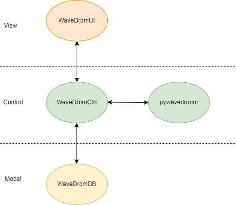

== À propos de WaveDromGen

_WaveDromGen_ est une interface graphique pour générer des chronogrammes numériques basée sur https://wavedrom.com/[_WaveDrom_]. Cet outil est plus pratique que le logiciel _WaveDrom_. En effet, il y a la possiblité de créer directement nos chronogrammes à partir de la zone de dessin. L'ajustement peut toujours se faire à partir du code _Json_.

== Caractéristiques

**Création**

- dessiner des formes d'onde dans l'interface graphique _WaveView_
- coder des formes d'onde en _Json_ dans l'éditeur de texte _EditorView_

Ces deux interfaces sont synchronisées.

**Rendus**

- formats _Json_, _PNG_ et _SVG_
- possiblité d'avoir un rendu en Ascii dans _AsciiView_

== Structure du répertoire

[source, wavejson]
----
│  main.py                  # entrée principale
│  package2exe.py           # empaqueter le code source en exécutable (.exe)
├─asset                     # répertoire images
└─WaveDromGen# 
        language.py         # dictionnaire de langage UI
        WavedromASCII.py    # wavedrom vers ascii
        WaveDromCtrl.py     # controleur
        WaveDromDB.py       # model
        WaveDromUI.py       # view (UI principale)
        WaveImageDB.py      # base de données binaire des icônes, pour empaqueter tout en exécutable
        WaveNote.py         # editeur de texte wavedrom
        __init__.py
----

== Installation

Deux manières de l'installer

**1**: https://github.com/Tamachiii/WaveDromGen/releases/[Download the release version], puis lancer l'exécutable (utilisable que sur Windows).

**2**: Télécharger le code source Python:

        - 1. git clone https://github.com/Tamachiii/WaveDromGen.git
        - 2. pip install -r requirement
        - 3. python main.py

== Utilisation

=== WaveView

image::asset/md/ui_wave.png[waveview]

1. **Menu**: barre de menu
2. **View**:
	- WaveView: dessiner une forme d'onde en cliquant sur la zone de dessn
	- EditorView: dessiner une forme d'onde en codant du texte
	- AsciiView: ne peut pas être éditée, sortie de forme d'onde ascii en temps réel.
3. **Wave Toolbar**
        - **clk (clock):** en mode clk, cliquer sur la zone de dessin dessinera la forme d'onde de l'horloge. Cliquer sur la même position plus d'une fois ajustera la sensibilité de l'horloge comme ci-dessous: **high level -> pos edge -> low level -> neg edge**.
        - **sig (single-bit signal):** en mode sig, cliquer sur la zone de dessin dessinera un seul bit bas. Cliquer à nouveau sur la même position pour monter haut.
        - **bus (muti-bit signal):** en mode bus, cliquer sur le zone de dessin dessinera la balise bus. Cliquer à nouveau sur la même position pour annuler.
        - **x (no care signal):** en mode x, cliquer sur la zone de dessin dessinera le tag x. Cliquer à nouveau sur la même position pour annuler.
        - **gap (no care signal):** en mode gap, cliquer sur la zone de dessin dessinera un espace. Cliquer à nouveau sur la même position pour annuler.
        - **z (high impedance):** en mode z, cliquer sur la zone de dessin dessinera le tag z. Cliquer à nouveau sur la même position pour annuler.
        - **sel (select):** en mode sel, il y a 4 usages selon la position du clic.
                * 1. Cliquer sur une zone sans forme d'onde sur le canevas ajoutera le nombre de lignes et de colonnes.
                * 2. Faire glisser la forme d'onde vers le haut ou vers le bas ajustera l'index de ligne.
                * 3. Maintenir CTRL enfoncé tout en faisant glisser une forme d'onde vers le haut ou vers le bas copiera la forme d'onde correspondante.
                * 4. Faire glisser la forme d'onde vers la gauche et vers la droite déplacera la forme d'onde latéralement.
    - **t (text):** en mode t, cliquer sur le nom du signal ou la balise de bus permet de modifier la description.
    - **clr (clear):** en mode clr, cliquer sur la forme d'onde dans la zone de dessin effacera toutes les données concernant ce signal.

=== EditorView

image::asset/md/ui_editor.png[editorview]

4. **EditorView Toolbar**
        - **rendre : ** fait un rendu du texte de l'éditeur pour générer une forme d'onde.
        - **copier : ** copier ce que vous sélectionnez dans l'éditeur.
        - **coller : ** coller le presse-papiers dans l'éditeur.
        - **annuler : ** annuler la dernière opération dans l'éditeur.
        - **rétablir : ** rétablir la dernière opération dans l'éditeur.
        - **trouver : ** rechercher dans l'éditeur.
5. **Eiteur: ** éditer du wavedrom dans la zone de texte, voir https://wavedrom.com/tutorial.html[_WaveDrom_] pour plus de détails.

=== Demos

**Création de waveform simples**

image::asset/md/ui_waveview.gif[gif waveview]

**Création de relations**

image::asset/md/ui_relation.gif[gif relation]

== Version modifiée

**Ajouts de fonctionnalités**

- Ajout langue (FR)
- Ajout de documentations
- Ajout de raccourcis
- Ajout attributs lenRow/lenCol pour la barre de statue
- Ajout barre de défilement dans WaveEditor
- Ajout d'un panneau de gestion des relations (relation_view)
- Ajout d'un panneau de gestion des périodes et phases (period_view)

**Modifications**

- Modification du menu principal

**Problèmes résolus :**

- Fonctions "save", "saveAs" et "open"
        * Permet la sauvegarde même si c'est pour un fichier qui a été ouvert
        * Permet la sauvegarde sous... 
        * Permet l'ouverture sans problème d'un fichier Json
- Fonctions "delRow", "delCol", "copyRow"
        * Permet de revenir à un état par défaut à la fin de chaque action de ces modes
- lenRow < 1 ou lenCol < 1
        * Permet de laisser une ligne/colonne par défaut lorsque toutes sont supprimées
- Fonction "search" dans Editor
        * Redimensionnement de la fenêtre par langue corrigé
- Fonction MouseWheel dans img_view
        * Bind d'évenement "MouseWheel" par rapport à la dimension du canva pour défiler
- Fonction Annoter "relation"
        * Permet de continuer à utiliser d'autres modes après l'ajout de relation
- Fonction du curseur dans img_view
        * Permet au curseur de s'adapter en fonction de la dimension du canva
- Suppression des relations après le mode delRow
        * Modèle modifié (fichier ./WaveDromDB.py) : lorsque qu'une ligne qui contient des edges/relations est supprimée alors les relations en rapport avec ses edges sont supprimés eux aussi
- Fonction Annoter "edge"
        * Permet de vérifier la valeur entrée lors de la saisie du nom d'un edge