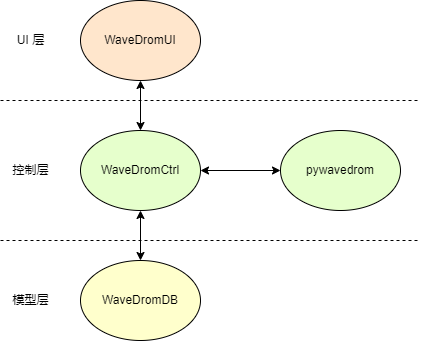
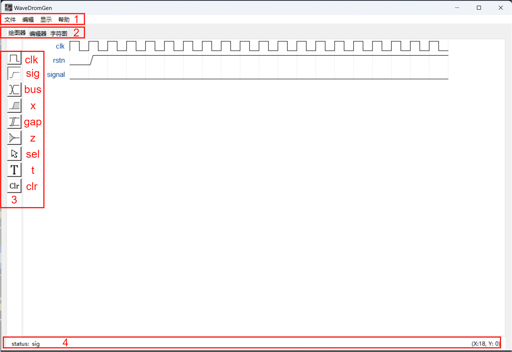
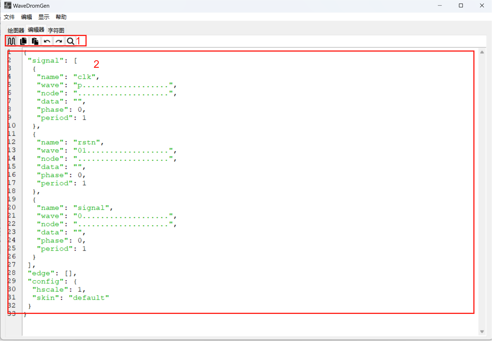

### About WaveDromGen

WaveDromGen is a GUI digital timing tool based on [wavedrom](https://wavedrom.com)，it's more convenience than wavedrom because WaveDromGen don't need to code for waveform, you just need to click for what you need. WaveDromGen is more suitable for drawing in complex waveform. You can also code in WaveDromGen if you like.

### Feature
- Drawing waveform in GUI，coding or ascii waveform.
- Drawing digital waveform in style of wavedrom, and output database(.json) is same as wavedrom text.
- Save as json, png and svg.

### Directory
```commandline
│  main.py                  main entry
│  package2exe.py           package code to exe
├─asset                     image asset
└─WaveDromGen
        language.py         UI language dict
        WavedromASCII.py    wavedrom to ascii
        WaveDromCtrl.py     contoller
        WaveDromDB.py       datebase model
        WaveDromUI.py       UI top
        WaveImageDB.py      icon binary database, for package all into exe
        WaveNote.py         waveform editor in text
        __init__.py
```


### Install
You can install in below 2 ways:
- Way 1：[Download the release](https://gitee.com/sjkpy/WaveDromGen/releases)（just for windows now）and click to exe.
- Way 2：Download python source code：
- 1. git clone https://gitee.com/sjkpy/WaveDromGen.git
  2. pip install -r requirement
  3. python main.py

### Usage
#### Wave


1. Menu，basic edit option
2. Display：
	- 绘图器：点击波形绘图
	- 编辑器：使用代码进行绘图
	- 字符图：不可编辑，实时将波形准换为ascii图
3. 绘图器工具栏，从上至下依次为：
	- **clk：时钟**，点击后在波形区点击任意位置，将产生时钟波形，再次点击相同位置将改变值，值为依次为正时钟 -> 上升沿 -> 负时钟 -> 下降沿；
    - **sig：单比特信号**，点击后在波形区点击任意位置，将产生0电平，再次点击相同位置将改变值为1;
    - **bus：总线信号**，点击后在波形区点击任意位置，将产生总线标识，再次点击相同位置将恢复；
    - **x：不定态**，点击后在波形区点击任意位置，将产生不定标识，再次点击相同位置将恢复；
    - **z：高阻态**，点击后在波形区点击任意位置，将产生高阻标识，再次点击相同位置将恢复；
    - **sel：选择**，点击后在波形区点击无波形区域，将增加行列数；上下拖动波形将调整波形位置；上下拖动波形时按住 ctrl 将复制对应波形；左右拖动波形将横向移动波形；
    - **t：文本框**，点击后在波形区点击信号名或总线标识，可修改对应名称；
    - **clr：清除**，点击后在波形区点击信号，将清除信号数据；
4. 状态栏

#### 编辑器



1. 编辑器工具栏，从左至右依次为：
   - **渲染：** 将编辑器内容渲染为波形图；
   - **复制：** 复制选中内容；
   - **粘贴：** 粘贴复制内容；
   - **撤销**；撤销上一步操作；
   - **重做**；重做撤销操作；
   - **搜索**；搜索关键字
2. **编辑区：** 编辑波形代码，语法遵循 [wavedrom](https://wavedrom.com/tutorial.html) 定义

### 演示


### 捐赠
如果WaveDromGen有帮助到你，可以请我喝杯咖啡哦~


