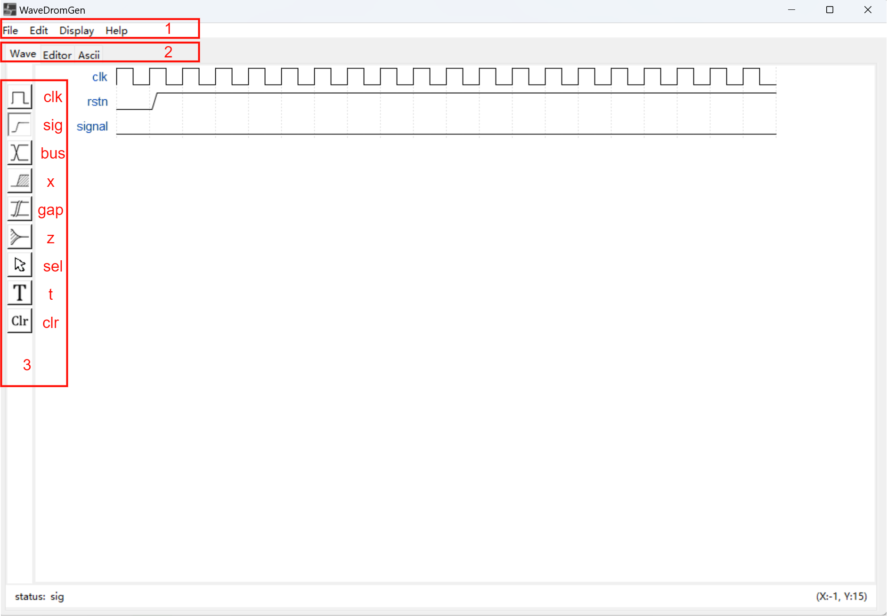
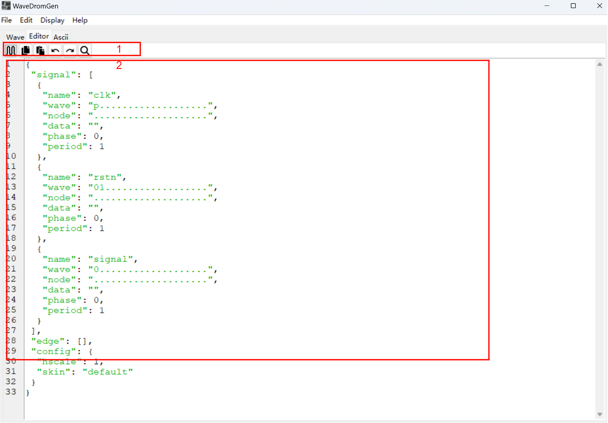

### 1. About WaveDromGen

WaveDromGen is a GUI digital timing tool based on [wavedrom](https://wavedrom.com)，it's more convenience than wavedrom because WaveDromGen don't need to code for waveform, you just need to click for what you need. WaveDromGen is more suitable for drawing in complex waveform. You can also code in WaveDromGen if you like.

### 2. Features
- Drawing waveform in GUI，coding or ascii waveform.
- Drawing digital waveform in style of wavedrom, and output database(.json) is same as wavedrom text.
- Save as json, png and svg.

### 3. Directory Structure
```commandline
│  main.py                  # main entry
│  package2exe.py           # package code to exe
├─asset                     # image asset
└─WaveDromGen# 
        language.py         # UI language dict
        WavedromASCII.py    # wavedrom to ascii
        WaveDromCtrl.py     # contoller
        WaveDromDB.py       # datebase model
        WaveDromUI.py       # UI top
        WaveImageDB.py      # icon binary database, for package all into exe
        WaveNote.py         # waveform editor in text
        __init__.py
```


### 5. Installation
You can install in below 2 ways:

**Way 1**：[Download the release](https://github.com/blueyesess/WaveDromGen/releases)（just for windows now）and click to exe.

**Way 2**：Download python source code：
   1. git clone https://github.com/blueyesess/WaveDromGen.git
   2. pip install -r requirement
   3. python main.py

### 6. Usage
#### 6.1 Wave View


1. **Menu**: basic menu functon
2. **View**：
	- Wave：draw waveform by clicking canvas.
	- Editor：draw waveform by coding text.
	- Ascii：can't edit，output ascii waveform in realtime.
3. **Wave Toolbar**
	- **clk (clock):** in clk mode, clicking on the canvas will draw clock waveform. Clicking same position more than one time will adjust clock sensitive as below: **high level -> pos edge -> low level -> neg edge**.
    - **sig (single-bit signal):** in sig mode, clicking on the canvas will draw single bit low . Click same position again to go high.
    - **bus (muti-bit signal):** in bus mode, clicking on the canvas will draw bus tag. Click same position again to cancel.
    - **x (no care signal):** in x mode, clicking on the canvas will draw x tag. Click same position again to cancel.
    - **z (high impedance):** in bus mode, clicking on the canvas will draw z tag. Click same position again to cancel.
    - **sel (select):** in sel mode, there are 4 usages according click position.
      1. Clicking on non-waveform zone on the canvas will add the number of rows and columns. 
      2. Dragging the waveform up or down will adjust the row index.
      3. Holding down CTRL while dragging a waveform up or down will copy the corresponding waveform.
      4. Dragging the waveform left and right will move the waveform laterally.
    - **t (text):** in t mode, clicking signal name or bus tag could edit description.
    - **clr (clear):** in clr mode, clicking waveform on canvas will clear all data about this signal.

#### 6.2 Editor



1. **Editor Toolbar**
   - **render：** render the editor text to generate waveform.
   - **copy：** copy what select in editor.
   - **paste：** paste clipboard in editor.
   - **undo**；undo last operation in editor.
   - **redo**；redo last operation in editor.
   - **find**；find in editor.
2. **Editor：** edit wavedrom in text, see [wavedrom](https://wavedrom.com/tutorial.html) for details.

### 7. Demo


### 8. Donate
If you like WaveDromGen，please star it, or choose to buy a coffee for supporting me.


