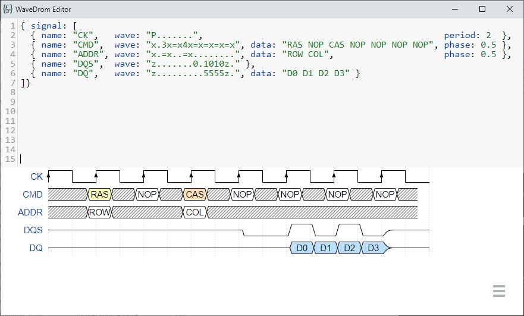
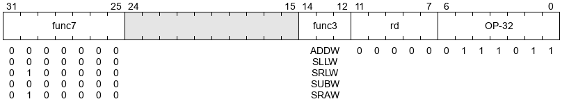
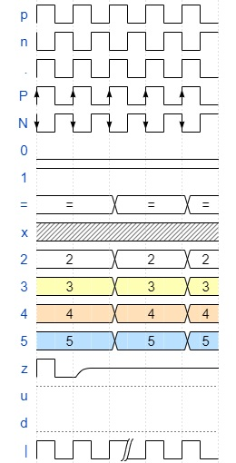
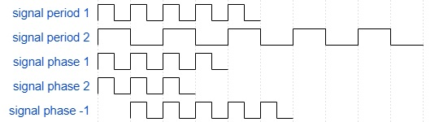
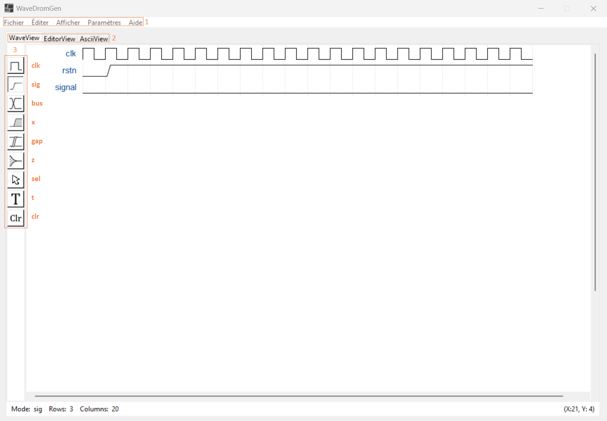
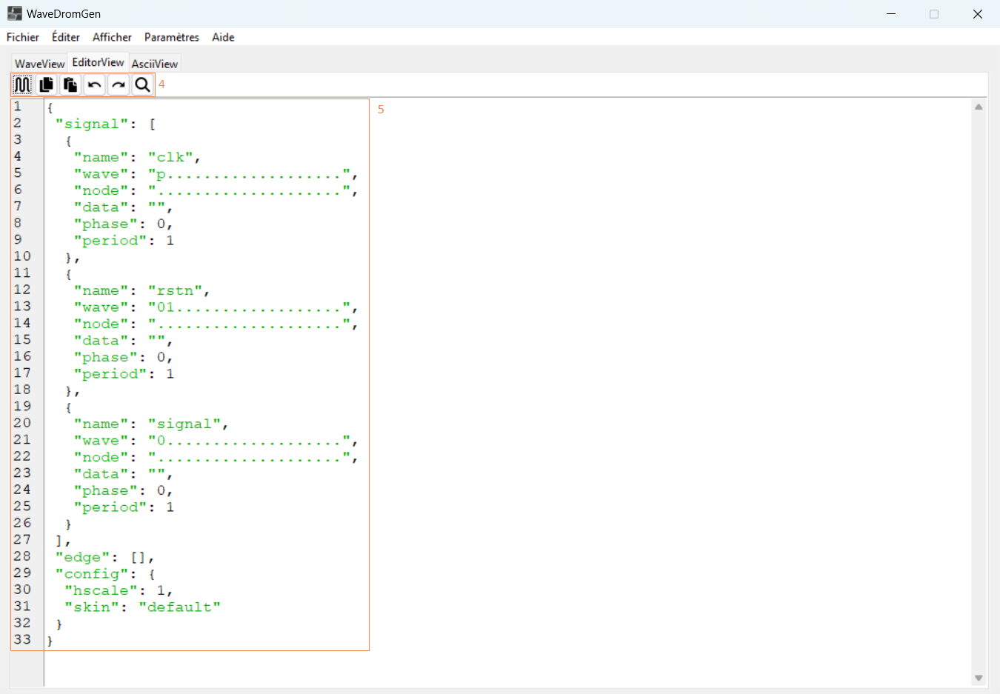
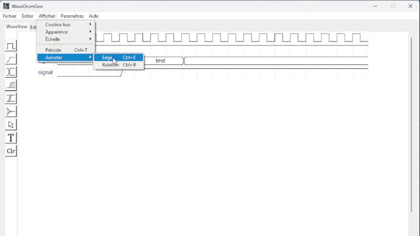

= Documentation logicielle : WaveDrom

Tony Nguyen
v1.2, 2023-01-13

:toc:
:toclevels: 4
:toc-title: Sommaire

== Introduction

=== Qu'est-ce que WaveDrom ?

https://wavedrom.com/[WaveDrom] est un logiciel open source qui permet de dessiner des https://en.wikipedia.org/wiki/Digital_timing_diagram[chronogrammes numériques] à partir d'un contenu écrit en _JSON_. Il utilise une librairie _JavaScript_ afin de créer des rendus au format _SVG_ (convertisable en PNG).

***
=== En quoi est-il utile ?

WaveDrom est une bibliothèque _JavaScript_, de ce fait il peut être implémenté dans des contextes web. C'est à dire qu'on a la possibilité de manipuler nos chronogrammes à l'aide de script _JavaScript_ dans des pages _HTML_ et dans bien d'autres cas. Dans sa philosophie WaveDrom permet de créer des chronogrammes de qualité avec un design épuré. La description textuelle de nos attentes est guidée par la faculté qu'a _JSON_, de représenter des informations simplement et intuitivement.

***
=== Comment peut-on l'utiliser ?

Les chronogrammes peuvent se créer de différentes manières. Tout d'abord, ils sont éditables directement sur https://wavedrom.com/editor.html[l'éditeur en ligne] de WaveDrom. Les rendus se font très rapidement. Il est aussi disponible en version bureautique pour un usage plus professionnel.

[TIP]
Liens des version desktop : https://github.com/wavedrom/wavedrom.github.io/releases/download/v2.9.1/wavedrom-editor-v2.9.1-linux-x64.tar.gz[linux-x64.tar.gz] - 
https://github.com/wavedrom/wavedrom.github.io/releases/download/v2.9.1/wavedrom-editor-v2.9.1-osx-x64.zip[osx-64.zip] - 
https://github.com/wavedrom/wavedrom.github.io/releases/download/v2.9.1/wavedrom-editor-v2.9.1-win-x64.zip[win-x64.zip]

Ensuite, pour les utilisateurs d'IDE de développement, des plugins existent, par exemple sur VS Code, ils sont téléchargeables sur le https://marketplace.visualstudio.com/items?itemName=bmpenuelas.waveform-render[marketplace] afin d'éditer et d'obtenir votre rendu.

image::includes/images/editeur_vs_code.jpg[Plugin VS Code]

Dans la continuité des langages haut niveau, la création de chronogramme peut se faire avec des scripts Python. Il est intéressent de l'utiliser dans un notebook tel que Jupyter lorsque de la documentation est nécessaire.

[TIP]
Cette librairie _Python_ (wavedrompy) est disponible sur le site https://pypi.org/project/wavedrom/[pypi.org].

.Exemple d'utilisation avec Python
[source, python]
----
import wavedrom
svg = wavedrom.render("""
{   "signal": [
        { "name": "CK",   "wave": "P.......",                                              "period": 2  },
        { "name": "CMD",  "wave": "x.3x=x4x=x=x=x=x", "data": "RAS NOP CAS NOP NOP NOP NOP", "phase": 0.5 },
        { "name": "ADDR", "wave": "x.=x..=x........", "data": "ROW COL",                     "phase": 0.5 },
        { "name": "DQS",  "wave": "z.......0.1010z." },
        { "name": "DQ",   "wave": "z.........5555z.", "data": "D0 D1 D2 D3" }
    ]
}""")
svg.saveas("demo1.svg")
----

.Exemple d'utilisation avec JavaScript
[source, javascript]
----

----

.Résultat

image::includes/images/chronogramme.jpg[Chronogramme]

Pour finir, WavaDrom possède d'autres fonctionnalités comme la création de schéma électronique, ainsi que de documenter les bits d'un registre.

.Exemple de documentation de bits d'un registre

== Apprendre le WaveJSON

=== Quelques notions JSON

JavaScript Object Notation (_JSON_) est une manière d'exprimer des objets _JavaScript_. L'assimilation de ce langage est très simple car cela a été conçu pour l'échange de données lisibles par l'homme. De plus, les conventions synthaxiques sont déjà connus par les utilisateurs des langages tels que _Java_, _C_, _C++_, etc... On retrouve les types couramment utilisés en programmation : _string_, _int_, _float_, _boolean_, etc...

Ci-dessous, on peut voir une vue rapide de la synthaxe qu'utilise _JSON_, on remarque qu'elle utilise un principe de _clé:valeur_.

.Exemple représentation fiche coordonnées d'un individu
[source, json]
----
{
    "firstName": "Tony",
    "lastName": "Nguyen",
    "isAlive": true,
    "age": 19,
    "height": 172.3,
    "address": {
        "streetAddress": "1 Rue des Champs-élysées ",
        "city": "Île-de-france",
        "state": "FRA",
        "postalCode": "75001"
    },
    "phoneNumbers": [
        {
            "type": "home",
            "number": "0512324252"
        },
        {
            "type": "office",
            "number": "0633404373"
        },
        "children": [],
        "spouse": null  
    ]
}
----

***
=== Chronogramme

[NOTE]
_WaveJSON_ est basé sur la synthaxe de _JSON_ et elle possède des mots clé réservés.

==== Signals, Waves

Le début de notre chronogramme est annoncé par l'utilisation du mot clé _signal_, celui-ci contient un tableau de signaux représentant des _WaveForm_.

.Exemple de signaux
[source, wavejson]
----
{   "signal" : [
        {signal1},
        {signal2},
        ...
    ]
}
----

Des signaux peuvent être regroupés entre eux lorsque dans un nouveau tableau, la première valeur est du type _string_.

.Exemple d'un groupement de signaux
[source, wavejson]
----
{
    "signal" : [
        [
            "Groupe1",
            {signal1},
            {signal2},
            ...
        ]
    ]
}
----

Nos signaux sont constitués en général des attributs _name_, _wave_ ainsi que _data_.

.Exemple d'un signal complet
[source, wavejson]
----
{
    "signal" : [
        {"name" : "Mon premier signal", "wave" : "x.3.4.x.", "data": "data1 data2"}
    ]
}
----

.Tableau descriptif des symboles composant une _WaveForm_ en WaveJSON
[cols=3*, options="header", cols="15, 50, 35"]
|===
| Symbole   | Description   | Exemple
| p | quand le premier dans la chaîne crée une onde d'horloge positive  | { "name": "p",  "wave": "ppppp"}
| n | quand le premier dans la chaîne crée une onde d'horloge negative  | { "name": "n", "wave": "nnnnn"}
| . | prolonge le cycle précédent                                       | { "name": ".", "wave": "....."}
| P | pareil que p mais avec une flêche                                 | { "name": "P","wave": "P...."}
| N | pareil que n mais avec une flêche                                 | { "name": "N", "wave": "N...."}
| 0 | pique d'onde bas niveau                                           | { "name": "0", "wave": "0...."}
| 1 | pique d'onde haut niveau                                          | { "name": "1", "wave": "1...."}
| = | valeur (default color 2)                                          | { "name": "=", "wave": "=.=.=", data: "A B C"}
| x | valeur indéfini                                                   | { "name": "x", "wave": "x...."}
| 2 | valeur avec la couleur 2                                          | { "name": "2", "wave": "2.2.2", data: "2 2 2"}
| 3 | valeur avec la couleur 3                                          | { "name": "3", "wave": "3.3.3", data: "3 3 3"}
| 4 | valeur avec la couleur 4                                          | { "name": "4", "wave": "4.4.4", data: "4 4 4"}
| 5 | valeur avec la couleur 5                                          | { "name": "5", "wave": "5.5.5", data: "5 5 5"}
| z | état d'haute impédance (hi-Z)                                     | { "name": "z", "wave": "pz..."}
| u | A compléter...                                                    | { "name": "u", "wave": "u...."}
| d | A compléter...                                                    | { "name": "d", "wave": "d...."}
|\| | pareil que . mais rajoute un espace entre deux cycles             | { "name": "\|", "wave": "p.\|.."}
|===

.Correspondances avec le tableau

==== Periods, Phases

Les _périodes_ et les _phases_ sont représentées par des entiers. Pour une _phase_, lorsque l'entier est positif on se déplace dans le future, lorsqu'il est négatif alors on se déplace dans le passé. Ils se construisent dans un signal à l'aide des mots _period_ et _phase_.

.Exemple de périodes et de phases
[source, wavejson]
----
{
    "signal" : [
      {"name" : "signal period 1", "wave": "p....", "period": 1},
      {"name" : "signal period 2", "wave": "p....", "period": 2},
      {"name" : "signal phase 1", "wave": "p....", "phase": 1},
      {"name" : "signal phase 2", "wave": "p....", "phase": 2},
      {"name" : "signal phase -1", "wave": "p....", "phase": -1}
	]
}
----

.Exemple de périodes et de phases

==== Nodes, Edges, Arrows

Les noeuds (_nodes_) permettent de créer des marqueurs visibles ou non sur un seul cycle.

- . pas de marqueur
- [A-Z] marqueur invisible
- other marqueur visible

.Exemple d'un node
[source, wavejson]
----
{
    "signal" : [
      {"name" : "signal1", "wave": "x.=x3x4xx", "node" : "..a..b..C.."},
	]
}
----

.Exemple d'node
image::includes\images\node.jpg[Node]

Les noeuds peuvent être relié entre eux par des flêches (_arrows_). Cela forme des arètes/relations (_edges_), elles sont définis grâce au mot clé _edge_. Pour les relier, il suffit de créer un tableau qui contient une paire de noeuds séparée par un type de flêche.

- - déplacer la flêche horizontalement (x+)
- | déplacer la flêche verticalement (y+)
- ~ rend la forme de la flêche incurvée (x+, y+)
- / ajouter une ligne en diagonale (x+, y+)

.Exemple de nodes avec des edges
[source, wavejson]
----
{
    "signal" : [
      {"name" : "signal1", "wave": "x.=x3x4xx", "node" : "..a..b..C.."},
      {},
      {"name" : "signal2", "wave": "x.......5", "node" : "........d.."}
	],
    "edge" : [
        "a->d edge 1", "b-~>d edge 2", "C->d edge 3"
    ]
}
----

.Exemple edges
image::includes\images\edge.jpg[Edge]

==== Properties

Les rendues des chronogrammes au format SVG peuvent être accompagnés de propriétés basées sur du JsonML.

***
=== Bits de registre

Sur le même principe, la documentation des bits d'un registre possède des attributs similaires : _name_, _bits_ et _attr_. Cependant, il se crée grâce à l'élement _reg_ qui est lui aussi un tableau.

.Exemple d'une représentation de bits d'un registre
[source, wavejson]
----
{
    reg: [
        {name: 'OP-32', bits: 7,  attr: 0b0111011},
        {name: 'rd',     bits: 5,  attr: 0},
        {name: 'func3',  bits: 3, attr: ['ADDW', 'SLLW', 'SRLW', 'SUBW', 'SRAW']},
        {bits: 10},
        {name: 'func7',  bits: 7, attr: [0, 0, 32, 0, 32]}
    ]
}
----

.Exemple registres

== WaveDromGen

=== À propos de WaveDromGen

_WaveDromGen_ est une interface graphique pour générer des chronogrammes numériques basée sur https://wavedrom.com/[_WaveDrom_]. Cet outil est plus pratique que le logiciel _WaveDrom_. En effet, il y a la possiblité de créer directement nos chronogrammes à partir de la zone de dessin. L'ajustement peut toujours se faire à partir du code _Json_.

***
=== Caractéristiques

**Création**

- dessiner des formes d'onde dans l'interface graphique _WaveView_
- coder des formes d'onde en _Json_ dans l'éditeur de texte _EditorView_

Ce qui est intéressent est le fait qu'on a accès à la fois à une vue graphique mais aussi à une vue textuelle. Ces deux interfaces sont synchronisées en temps réel.

**Rendus**

- formats _Json_, _PNG_ et _SVG_
- possiblité d'avoir un rendu en Ascii dans _AsciiView_

***
=== Installation

Deux manières de l'installer

**1**: https://github.com/Tamachiii/WaveDromGen/releases/[Download the release version], puis lancer l'exécutable (utilisable que sur Windows).

**2**: Télécharger le code source Python:

        - 1. git clone https://github.com/Tamachiii/WaveDromGen.git
        - 2. pip install -r requirement
        - 3. python main.py

***
=== Utilisation

==== WaveView

1. **Menu**: barre de menu
2. **View**:
	- WaveView: dessiner une forme d'onde en cliquant sur la zone de dessn
	- EditorView: dessiner une forme d'onde en codant du texte
	- AsciiView: ne peut pas être éditée, sortie de forme d'onde ascii en temps réel.
3. **Wave Toolbar**
        - **clk (clock):** en mode clk, cliquer sur la zone de dessin dessinera la forme d'onde de l'horloge. Cliquer sur la même position plus d'une fois ajustera la sensibilité de l'horloge comme ci-dessous: **high level -> pos edge -> low level -> neg edge**.
        - **sig (single-bit signal):** en mode sig, cliquer sur la zone de dessin dessinera un seul bit bas. Cliquer à nouveau sur la même position pour monter haut.
        - **bus (muti-bit signal):** en mode bus, cliquer sur le zone de dessin dessinera la balise bus. Cliquer à nouveau sur la même position pour annuler.
        - **x (no care signal):** en mode x, cliquer sur la zone de dessin dessinera le tag x. Cliquer à nouveau sur la même position pour annuler.
        - **gap (no care signal):** en mode gap, cliquer sur la zone de dessin dessinera un espace. Cliquer à nouveau sur la même position pour annuler.
        - **z (high impedance):** en mode z, cliquer sur la zone de dessin dessinera le tag z. Cliquer à nouveau sur la même position pour annuler.
        - **sel (select):** en mode sel, il y a 4 usages selon la position du clic.
                * 1. Cliquer sur une zone sans forme d'onde sur le canevas ajoutera le nombre de lignes et de colonnes.
                * 2. Faire glisser la forme d'onde vers le haut ou vers le bas ajustera l'index de ligne.
                * 3. Maintenir CTRL enfoncé tout en faisant glisser une forme d'onde vers le haut ou vers le bas copiera la forme d'onde correspondante.
                * 4. Faire glisser la forme d'onde vers la gauche et vers la droite déplacera la forme d'onde latéralement.
    - **t (text):** en mode t, cliquer sur le nom du signal ou la balise de bus permet de modifier la description.
    - **clr (clear):** en mode clr, cliquer sur la forme d'onde dans la zone de dessin effacera toutes les données concernant ce signal.

==== EditorView

4. **EditorView Toolbar**
        - **rendre : ** fait un rendu du texte de l'éditeur pour générer une forme d'onde.
        - **copier : ** copier ce que vous sélectionnez dans l'éditeur.
        - **coller : ** coller le presse-papiers dans l'éditeur.
        - **annuler : ** annuler la dernière opération dans l'éditeur.
        - **rétablir : ** rétablir la dernière opération dans l'éditeur.
        - **trouver : ** rechercher dans l'éditeur.
5. **Eiteur: ** éditer du wavedrom dans la zone de texte, voir https://wavedrom.com/tutorial.html[_WaveDrom_] pour plus de détails.

=== Demos

**Création de waveform simples**

image::includes/images/ui_waveview.gif[gif waveview]

**Création de relations**

